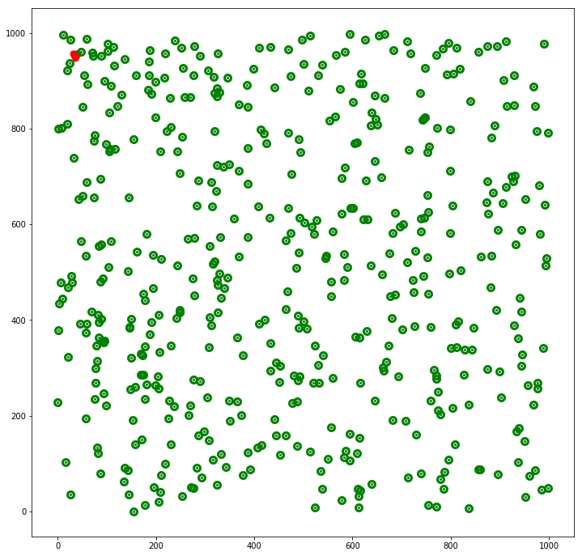
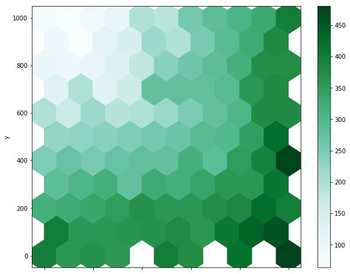

# WSN Simulation
A simulation code of wireless sensor network. The code simulates the situation that sink node disseminate code to the network. The simulation ends when all the sensor nodes in the network has received the code.
## run simulation
> run_sim(simulation_times,ABRCD=True/False,adapt_duty_cycle=True/False)

## display network deployment
> display_net(network)
output:
</img>
## display energy residual hexagonal binning plot
> display_energy_residual_heatmap(network, the_remaining_energy_of_network)
output:
</img>
